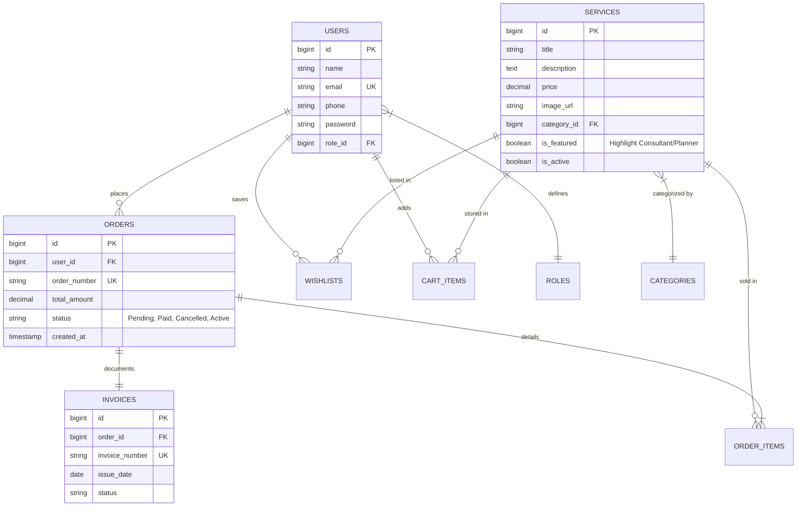
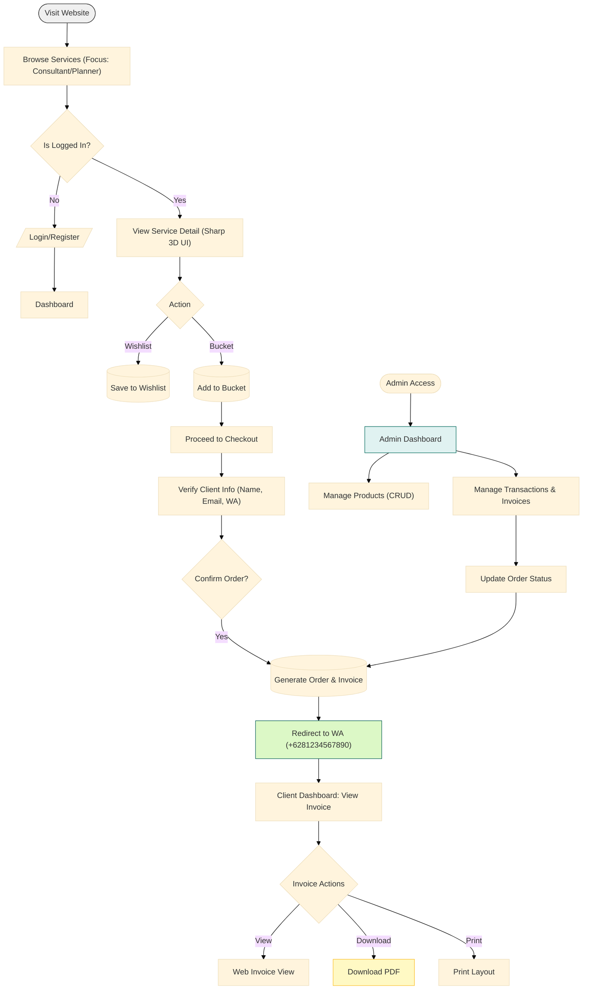

# Product Requirements Document (PRD) - Fintech E-Commerce Platform

## 1. Project Overview
Project Name: Fintech Services E-Commerce
Goal: A premium, minimalist e-commerce platform dedicated to selling various financial services (fintech) with a focus on high accountability, professional design, and a "wealth" atmosphere.

## 2. Tech Stack
- **Backend**: Laravel 12
- **Frontend**: blade + Tailwind CSS
- **Database**: sqlite
- **Integration**: Whatsapp redirection (+62 812 3456 7890)
- **Invoice**: PDF Generation

## 3. Design Principles
- **Minimalist & Clean**: Essential data only & clear hierarchy.
- **High Accountability**: Every action loggable, clear transaction states, and professional invoice trails.
- **Sharp & Elegant (Glassy Renders)**: Use sharp edges and glassy/translucent textures and some "claymorphism". Focus on premium metallic, crystal, and deep matte finishes.
- **Highlighted Categories**: Specialized UI focus for "Konsultan" and "Financial Planner" services.
- **"Money" Atmosphere**: Deep slates, emerald growth greens (#10B981), and gold accents against clean white backgrounds. Use of subtle gradients to represent wealth flow.

## 4. Key Features
### 4.1 Authentication & RBAC
- **Login/Register**: Standard secure authentication.
- **Roles**:
  - **Admin**: Full control over service catalog and transaction history.
  - **Client**: Dashboard for managing personal wealth-related services.

### 4.2 Core E-Commerce
- **Service Catalog**:
  - Featured section for **Consultants** and **Financial Planners**.
  - Dynamic filtering/search.
- **Wishlist**: Save services with "Future Goals" terminology.
- **Bucket (Cart)**: Efficient service bundling.

### 4.3 Checkout & Integration
- **Mandatory Login**: Prevents guest checkout for accountability.
- **WA Redirect**: Direct flow to +62 812 3456 7890 with dynamic order summary.
- **Invoice System**:
  - Dynamic view in dashboard.
  - Download as PDF.
  - Direct Browser Print support.

### 4.4 Dashboards
- **Admin Dashboard**:
  - **Manage Products**: Add, edit, delete financial services.
  - **Manage Transactions**: View all orders, update payment status, view invoices.
  - Client analytics.
- **Client Dashboard**:
  - Personal Order History & Active Services.
  - Invoice Management (View/Download/Print).

## 5. Entity Relationship Diagram (ERD)

## 6. Official Project Flowchart

## 7. Design Component Strategy
- **Service Cards**: Use `backdrop-filter: blur()` (Glassmorphism) combined with ultra-thin white borders (0.5px).
- **Typography**: Primary: **Inter Variable** for body. Secondary: **Cormorant Garamond** or similar for headings to add a "Wealthy/Classic" touch.
- **Admin Table**: Clean, striped rows, specialized tags for status (`active`, `paid`, `pending`) using emerald and slate tones.
- **Invoice UI**: High-contrast typography, minimalist logo, QR code for verification, and a clear "Verified Accountability" watermark.
